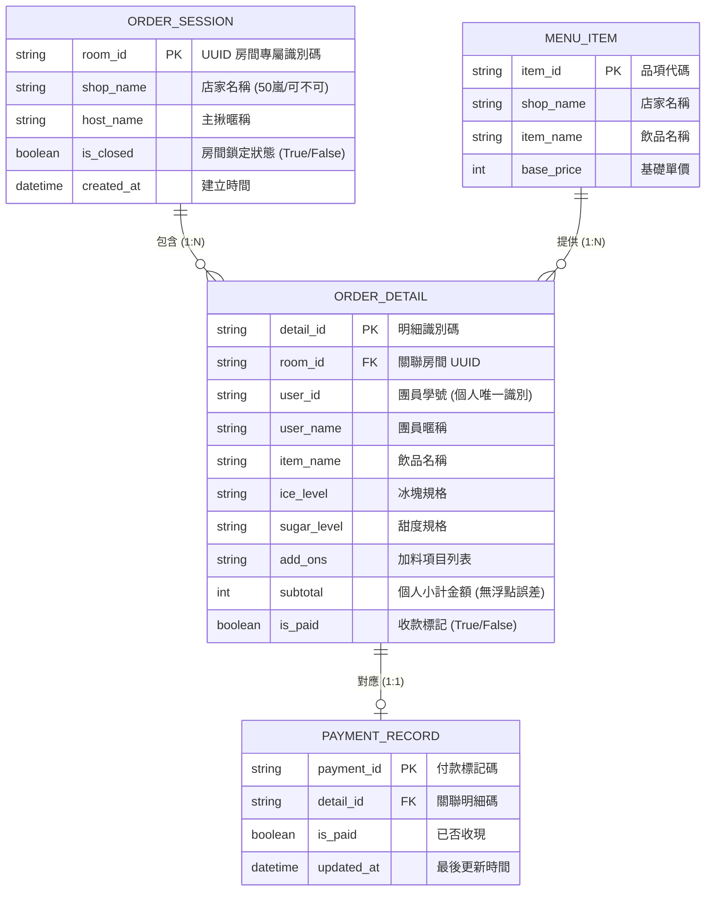

# 實體關係圖 (ERD) Mermaid 原始碼




---

### 7. `0722_ERD_Data_Rules_SRS_Checkpoint/normalization_and_data_issues.md`

```markdown
# 正規化與 M:N 拆解說明 (Normalization & Data Issues)

## 1. 多對多 (M:N) 關係拆解
* **原始關係：** `OrderSession` (房間) M : N `Participant` (團員)。
* **拆解理由：** 若直接保留 M:N，無法儲存每次揪團的特定飲品、客製化甜度冰塊、加料金額與付款勾選狀態。
* **關聯實體 (Associative Entity)：** 建立 `OrderDetail`（點單明細），包含外來鍵 `room_id` 與學號 `user_id`。
* **複合唯一限制：** 設定 `UNIQUE(room_id, user_id)`，團員於同一房間重複提交時自動覆蓋更新，避免建立多筆混淆訂單。

## 2. 正規化問題與修正診斷表

| 問題編號 | 診斷類型 | 原始結構問題與症狀 | 解決方案與修正機制 |
| :--- | :--- | :--- | :--- |
| **DATA-01** | 非單一值 / 1NF | 早期將配料加價存為逗號分隔字串，導致金額無法以程式精確累加。 | 配料金額由後端固定字典查表（珍珠+10/椰果+10），小計欄位 (`subtotal`) 保存為原生 Integer。 |
| **DATA-02** | 重複保存 / 2NF | 明細表一度嘗試儲存店家的聯絡電話與地址，造成資料大量重複。 | 將店家屬性抽離，僅於 `OrderSession` 保留 `shop_name`，消除冗餘欄位。 |
| **DATA-03** | 衍生資料同步異常 | 同時儲存總金額與個人小計，手動修改易致矛盾。 | 規定店家總金額與杯數由 `OrderDetail.subtotal` 與 `item_name` 動態 Group By 計算，不於 DB 重複存死欄位。 |
```
