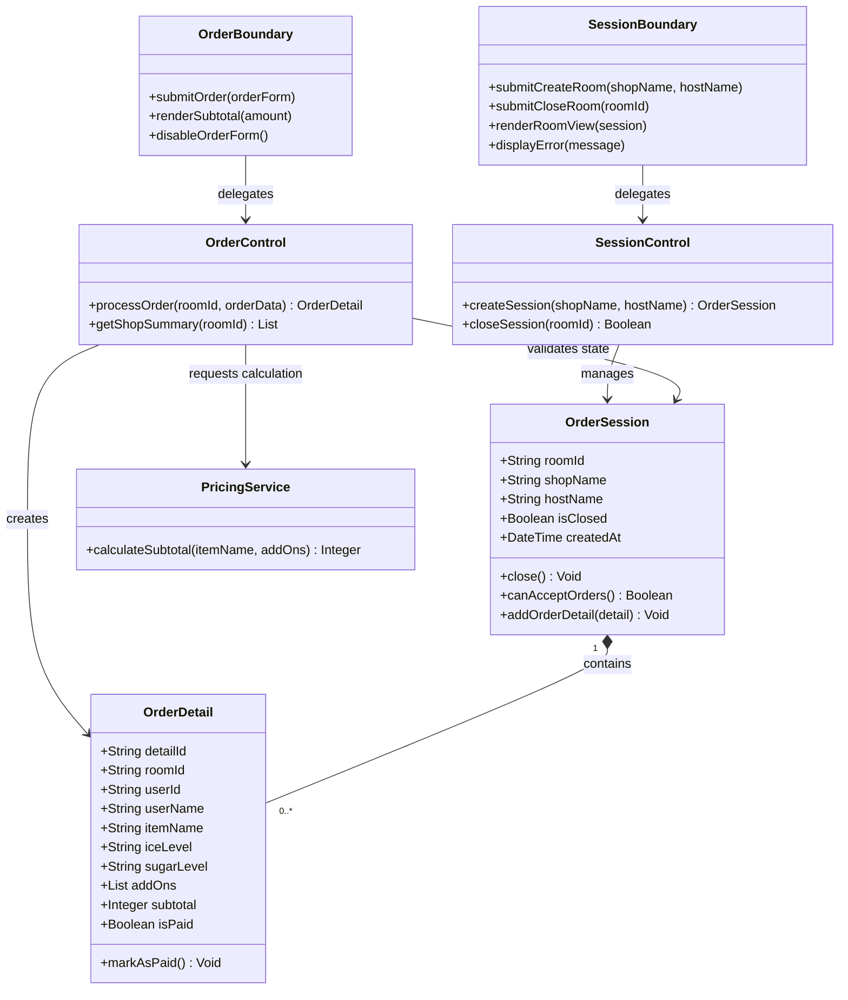

# 系統分析與設計：0727 物件導向分析 (OOA)、類別圖、循序圖與狀態圖成果

* **課程名稱：** 系統分析與設計
* **日期：** 115/07/27
* **小組名稱：** group01
* **專案名稱：** 團訂飲料系統
* **組員與分工：** 陳昱丞 (負責 OOA 類別分析、CRC 卡整理、BCE 檢核、Class/Sequence/State Diagram 繪製、跨模型矩陣與 main.py 物件化重構)
* **GitHub 儲存庫：** https://github.com/tku-im-sad/beverage-group-buying-system
* **成果資料夾：** `0727_Object_Oriented_Analysis`

---

## A. 模型基準表 (model_baseline.md)

| 基準項目             | 基準版本 / Commit    | 納入範圍                                  | 備註說明                   |
| :------------------- | :------------------- | :---------------------------------------- | :------------------------- |
| **需求與 SRS** | SRS v1.0 (BL-SRS-01) | FR-01~05, NFR-01~03, BR-01~03            | 確立範圍內與範圍外         |
| **資料與流程** | DFD v1.0, ERD v1.0   | 5 大實體、5 個 DFD 處理程序               | 作為分析類別與物件狀態基礎 |
| **程式碼實作** | main.py (Refactored) | FastAPI 物件化路由與 Session Domain Model | 將邏輯抽離至 Domain 物件   |

---

## B. 8 張 CRC 類別責任卡 (crc_cards.md)

### CRC-01: SessionBoundary (邊界類別)

* **類別名稱：** `SessionBoundary` | **類型：** Boundary
* **主要責任：** 接收主揪開團與結單請求、渲染開團結果與對帳頁面、顯示結單成功或錯誤提示。
* **重要屬性：** `shopNameInput`, `hostNameInput`
* **主要操作：** `renderRoom()`, `displayClosedState()`, `showError(msg)`
* **協作者：** `SessionControl`
* **來源/理由：** UC-01, UC-04 / 隔離 UI 與商業邏輯。

### CRC-02: OrderBoundary (邊界類別)

* **類別名稱：** `OrderBoundary` | **類型：** Boundary
* **主要責任：** 接收團員點餐與客製化加料表單、渲染點餐成功回應與小計金額、停用已結單房間之按鈕。
* **重要屬性：** `userIdInput`, `selectedItem`, `addonsCheckboxes`
* **主要操作：** `submitOrder()`, `disableForm()`, `renderSubtotal(amount)`
* **協作者：** `OrderControl`
* **來源/理由：** UC-02, BR-01 / 提供團員點餐介面。

### CRC-03: SessionControl (控制類別)

* **類別名稱：** `SessionControl` | **類型：** Control
* **主要責任：** 協調開團流程、生成 UUID、觸發一鍵結單並將狀態鎖定指令下發至 `OrderSession`。
* **重要屬性：** `activeSessions`
* **主要操作：** `createSession(shop, host)`, `closeSession(roomId)`
* **協作者：** `OrderSession`, `SessionBoundary`
* **來源/理由：** UC-01, UC-04 / 協調開團與鎖定使用案例。

### CRC-04: OrderControl (控制類別)

* **類別名稱：** `OrderControl` | **類型：** Control
* **主要責任：** 協調點餐流程、向 `OrderSession` 查詢 `is_closed` 狀態、呼叫 `PricingService` 計算金額並建立 `OrderDetail`。
* **重要屬性：** `pricingService`
* **主要操作：** `processOrder(roomId, orderData)`, `validateState(roomId)`
* **協作者：** `OrderSession`, `OrderDetail`, `PricingService`
* **來源/理由：** UC-02, BR-02 / 協調點餐與鎖定攔截驗證。

### CRC-05: OrderSession (實體類別)

* **類別名稱：** `OrderSession` | **類型：** Entity
* **主要責任：** 保存房間生命週期、維護 `is_closed` 狀態、執行 `close()` 鎖定動作並阻斷非法修改。
* **重要屬性：** `roomId`, `shopName`, `hostName`, `isClosed`, `createdAt`
* **主要操作：** `close()`, `canAcceptOrders()`, `addOrderDetail(detail)`
* **協作者：** `OrderDetail`
* **來源/理由：** ERD OrderSession, BR-01 / 核心業務領域實體。

### CRC-06: OrderDetail (實體類別)

* **類別名稱：** `OrderDetail` | **類型：** Entity
* **主要責任：** 保存團員點單明細、客製化選項與金額小計、維護付款標記 (`isPaid`)。
* **重要屬性：** `detailId`, `roomId`, `userId`, `userName`, `itemName`, `subtotal`, `isPaid`
* **主要操作：** `markAsPaid()`, `updateOrder(newItem, newSubtotal)`
* **協作者：** `OrderSession`
* **來源/理由：** ERD OrderDetail, DR-04 / 點單紀錄實體。

### CRC-07: PricingService (領域服務類別)

* **類別名稱：** `PricingService` | **類型：** Entity / Domain Service
* **主要責任：** 封裝飲品底價與配料加價邏輯，計算 100% 精確且無浮點數累積誤差之金額。
* **重要屬性：** `menuPrices`, `addonPrices`
* **主要操作：** `calculateSubtotal(item, addons)`
* **協作者：** `OrderControl`
* **來源/理由：** NFR-01, BR-03 / 確保計算零誤差與內聚。

### CRC-08: ReportService (領域服務類別)

* **類別名稱：** `ReportService` | **類型：** Entity / Domain Service
* **主要責任：** 讀取已結單房間之明細，進行品項 Group By 歸類合併產出「店家總單」與「團員對帳單」。
* **重要屬性：** None
* **主要操作：** `generateShopSummary(roomId)`, `generateAuditList(roomId)`
* **協作者：** `OrderSession`, `OrderDetail`
* **來源/理由：** FR-04, FR-05 / 產出匯總報表。

---

## C. 類別明細與關係表 (class_details_and_relationships.md)

| 類別 A              | 關係類型    | 類別 B             | A端多重性 | B端多重性 | 業務規則依據                                           | 外來鍵 / 參考          |
| :------------------ | :---------- | :----------------- | :-------- | :-------- | :----------------------------------------------------- | :--------------------- |
| `SessionBoundary` | Association | `SessionControl` | `1`     | `1`     | 介面將開團/結單動作交由 SessionControl 協調            | 方法呼叫               |
| `OrderBoundary`   | Association | `OrderControl`   | `1`     | `1`     | 介面將點餐動作交由 OrderControl 協調                   | 方法呼叫               |
| `SessionControl`  | Association | `OrderSession`   | `1`     | `0..*`  | 一個 Control 可管理多個房間實體                        | `roomId`             |
| `OrderControl`    | Association | `PricingService` | `1`     | `1`     | OrderControl 依賴 PricingService 計價                  | 依賴注入               |
| `OrderSession`    | Composition | `OrderDetail`    | `1`     | `0..*`  | **BR-01：** 點單強烈依附房間，房間刪除明細亦消失 | `OrderDetail.roomId` |

---

## D. BCE 責任分配檢核表 (bce_responsibility_check.md)

| 使用案例步驟      | 外部事件         | Boundary 邊界責任               | Control 控制責任                       | Entity 實體責任                                  | 檢核結果           |
| :---------------- | :--------------- | :------------------------------ | :------------------------------------- | :----------------------------------------------- | :----------------- |
| **1. 開團** | 輸入店家並提交   | `SessionBoundary`: 接收輸入   | `SessionControl`: 生成 UUID 房間     | `OrderSession`: 建立實體 (`isClosed=False`)  | **符合 BCE** |
| **2. 點餐** | 選購飲料加料送出 | `OrderBoundary`: 接收點餐表單 | `OrderControl`: 協調驗證與計價       | `OrderSession`: 檢查 `canAcceptOrders()`     | **符合 BCE** |
| **3. 計價** | 自動計算金額     | `OrderBoundary`: 顯示小計     | `OrderControl`: 呼叫 PricingService  | `PricingService`: 精算加價金額                 | **符合 BCE** |
| **4. 寫入** | 儲存點單明細     | `OrderBoundary`: 提示成功     | `OrderControl`: 建立明細物件         | `OrderDetail`: 保存明細與 `isPaid=False`     | **符合 BCE** |
| **5. 結單** | 主揪點擊結單     | `SessionBoundary`: 變更 UI    | `SessionControl`: 觸發一鍵鎖定       | `OrderSession`: 執行 `close()` 改為 `True` | **符合 BCE** |
| **6. 防禦** | 結單後強行點餐   | `OrderBoundary`: 按鈕變灰     | `OrderControl`: 發現 locked 拋出 403 | `OrderSession`: 拒絕修改並維護鎖定狀態         | **符合 BCE** |

---

## E. 類別圖 (Class Diagram - class_diagram_source/README.md)



# 系統分析與設計：0722 實體關係圖 (ERD)、資料規則與 SRS v1 整合成果

* **課程名稱：** 系統分析與設計
* **日期：** 115/07/22
* **小組名稱：** group01
* **專案名稱：** 團訂飲料系統
* **組員與分工：** 陳昱丞 (負責 SA&D ERD 資料模型建構、M:N 關聯拆解、正規化分析、SRS v1 規格書整編與追溯維護)
* **GitHub 儲存庫：** https://github.com/tku-im-sad/beverage-group-buying-system
* **成果資料夾：** `0722_ERD_Data_Rules_SRS_Checkpoint`

## 📁 7/22 成果檔案架構與導覽

* [實體候選表 (entity_candidate_list.md)](./entity_candidate_list.md)
* [實體定義表 (entity_definitions.md)](./entity_definitions.md)
* [屬性字典 (attribute_dictionary.md)](./attribute_dictionary.md)
* [關係與業務規則表 (relationship_business_rules.md)](./relationship_business_rules.md)
* [正規化與 M:N 拆解說明 (normalization_and_data_issues.md)](./normalization_and_data_issues.md)
* [基數與資料規則檢核 (data_rule_cardinality_check.md)](./data_rule_cardinality_check.md)
* [DFD/ERD/原型一致性矩陣 (dfd_erd_mock_data_consistency.md)](./dfd_erd_mock_data_consistency.md)
* [軟體需求規格書 v1.0 (srs_v1.md)](./srs_v1.md)
* [基準版本紀錄 (baseline_record.md)](./baseline_record.md)
* [待確認問題清單 (open_issues.md)](./open_issues.md)
* [需求追溯矩陣 (traceability_matrix.md)](./traceability_matrix.md)
* [期中影片建議清單 (midterm_video_content_suggestions.md)](./midterm_video_content_suggestions.md)
* [程式碼代理提示詞 (code_agent_prompts.md)](./code_agent_prompts.md)
* [程式碼代理執行紀錄 (code_agent_log.md)](./code_agent_log.md)

# 系統分析與設計：0721 資料流程圖、資料流分析與資料字典成果報告

* **課程名稱：** 系統分析與設計
* **日期：** 115/07/21
* **小組名稱：** group01
* **專案名稱：** 團訂飲料系統
* **組員與分工：** 陳昱丞
* **GitHub 儲存庫：** https://github.com/tku-im-sad/beverage-group-buying-system
* **成果資料夾：** `0721_DFD_Data_Flow_Analysis`

---

## A. 分析基準表

| 成果類型             | 版本或連結 | 本次使用範圍                                     | 待確認問題 |
| :------------------- | :--------- | :----------------------------------------------- | :--------- |
| 專案章程             | v2.0       | 團訂飲料系統核心範圍（開團、選購買、鎖單、對帳） | 無         |
| 功能性需求與業務規則 | v1.0       | FR-01 至 FR-05、BR-01 至 BR-03                   | 無         |
| 使用案例與描述       | v2.0       | UC-01 至 UC-07、UC-04 描述                       | 無         |
| 目標流程             | v2.0       | TO-BE 泳道流程圖                                 | 無         |
| 流程資料交換表       | v1.0       | 8 筆核心流程資料交換                             | 無         |
| 實作品程式碼         | main.py    | FastAPI 後端 API 與 In-memory DB 結構            | 無         |

---

## B. 外部實體與資料交換清單 (至少 3 個外部實體 / 8 筆資料交換)

### 1. 外部實體清單

* **E1 主揪 (Host)：** 發起揪團、設定店家、執行結單鎖定與對帳管理之使用者（位於系統邊界外）。
* **E2 一般團員 (Participant)：** 透過分享連結進入房間、點餐客製化與修改點單之使用者（位於系統邊界外）。
* **E3 外部店家 (External Shop)：** 接收彙總總單並製作飲料之實體店家（位於系統邊界外，本期僅接受主揪口頭報單）。

### 2. 資料交換清單

| 編號            | 外部實體    | 方向        | 資料流名稱     | 內容摘要                                               | 對應流程 | 對應需求 |
| :-------------- | :---------- | :---------- | :------------- | :----------------------------------------------------- | :------- | :------- |
| **EX-01** | E1 主揪     | 輸入        | 開團資訊       | 店家名稱 (shop_name)、主揪暱稱 (host_name)             | 1.0      | FR-01    |
| **EX-02** | E1 主揪     | 輸出        | 房間連結資訊   | UUID 房間網址 (/room/{uuid})                           | 1.0      | FR-01    |
| **EX-03** | E2 一般團員 | 輸入        | 點餐提交資料   | 學號 (user_id)、暱稱 (user_name)、品項、冰甜客製、加料 | 2.0      | FR-02    |
| **EX-04** | E2 一般團員 | 輸出        | 個人點餐回應   | 點餐成功訊息、個人小計金額 (subtotal)                  | 2.0      | FR-02    |
| **EX-05** | E1 主揪     | 輸入        | 結單指令       | 房間 UUID、結單觸發訊號 (is_closed=True)               | 3.0      | FR-03    |
| **EX-06** | E1 主揪     | 輸出        | 店家彙總總單   | 依飲品/冰甜/加料合併後之品項與總杯數                   | 4.0      | FR-04    |
| **EX-07** | E1 主揪     | 輸出        | 團員收款對帳單 | 團員清單、每人應付金額、付款標記勾選狀態               | 5.0      | FR-05    |
| **EX-08** | E3 外部店家 | 輸出 (線下) | 電話報單內容   | 飲料品項、總杯數、甜度冰塊客製需求                     | 4.0      | FR-04    |

## C. 系統環境圖 (Context Diagram)

系統環境圖將整套「團訂飲料系統」視為單一總處理程序 `0`，劃分出系統內部與外部實體的資料流邊界。

```mermaid
flowchart LR
    E1["E1 主揪"]
    E2["E2 一般團員"]
    E3["E3 外部店家"]
    P0(("0 團訂飲料系統"))

    E1 -->|"開團資訊"| P0
    P0 -->|"房間連結資訊"| E1
  
    E2 -->|"點餐提交資料"| P0
    P0 -->|"個人點餐回應"| E2
  
    E1 -->|"結單指令"| P0
    P0 -->|"店家彙總總單"| E1
    P0 -->|"團員收款對帳單"| E1
  
    P0 -.->"電話報單內容 (線下)"| E3
```
